# Sesha Sai Kalyanam - Project & Integration Showcase

## AI Engineering Portfolio Documentation

This document showcases my AI engineering projects, integrations, and end-to-end system design experience. It is written for recruiters, interviewers, technical reviewers, and GitHub visitors who want to understand what I built, how the systems work, and what integrations were involved.

---

## Table of Contents

1. [Integration Overview](#integration-overview)
2. [High-Level Architecture Pattern](#high-level-architecture-pattern)
3. [Featured Projects](#featured-projects)
4. [Integration Playbook](#integration-playbook)
5. [Project Summary Matrix](#project-summary-matrix)
6. [Interview Positioning](#interview-positioning)
7. [Future Improvements](#future-improvements)

---

# Integration Overview

## Core Integration Areas

| Area | Platforms / Tools | How I Use Them |
|---|---|---|
| LLMs & GenAI | Azure OpenAI, OpenAI, Gemini, AWS Bedrock, Groq, Hugging Face | Chat, summarization, RAG, agents, tool calling, structured extraction |
| Agent Frameworks | LangChain, LangGraph, AutoGen, CrewAI, Google ADK | Multi-step reasoning, agent routing, tool usage, workflow orchestration |
| Retrieval & Vector Search | Azure AI Search, FAISS, Pinecone, pgvector, embeddings | Semantic search, tenant-isolated retrieval, document Q&A |
| Cloud Platforms | Azure, AWS, GCP | AI deployment, storage, serverless APIs, ML pipelines, transcription |
| Data & Storage | PostgreSQL, S3, Azure Blob, local document stores | User data, chat history, document storage, vector metadata |
| Web Apps | Streamlit, React collaboration, REST APIs, WebSockets | Frontend AI interfaces, real-time streaming, backend AI services |
| Automation | n8n, webhooks, API workflows | Lead automation, quote engines, email workflows, backend triggers |
| Enterprise APIs | Microsoft Graph, Teams, Gmail/SMTP, AWS Transcribe | Enterprise chatbots, notifications, email automation, transcription |

---

# High-Level Architecture Pattern

Most of my AI systems follow a layered architecture where the LLM is only one part of the full workflow.

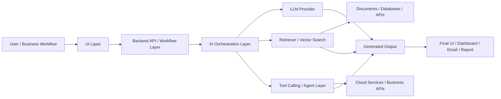

---

# Featured Projects

---

## 1. Multi-Tenant Isolated RAG System

**Category:** Enterprise RAG / Secure AI Retrieval  
**Repository:** [MultiTenant-Isolated-RAG-System](https://github.com/seshukalyanam/MultiTenant-Isolated-RAG-System)

### What It Does

This system allows multiple customers, teams, or tenants to ask questions over their own documents without exposing data from other tenants. It is designed for enterprise RAG scenarios where secure retrieval is just as important as answer quality.

### Problem Statement

A normal RAG chatbot can retrieve relevant chunks from a shared vector index, but in a multi-tenant environment relevance alone is not enough. The system must guarantee that one tenant cannot retrieve another tenant's private documents.

### Tech Stack

- Azure OpenAI
- Azure AI Search / Azure Cognitive Search
- Python
- Streamlit
- Embeddings
- Tenant-specific indexing
- Metadata filtering
- Conversation memory

### End-to-End Flow

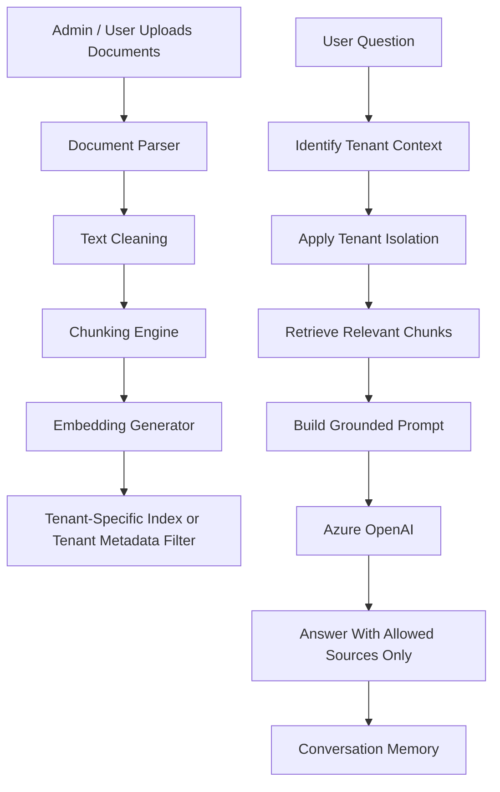

### Integration Flow

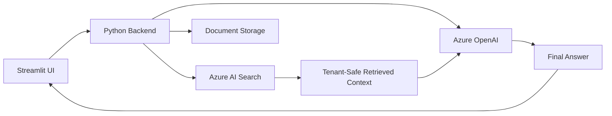

### Why It Matters

This project demonstrates production-level RAG thinking. The focus is not only on answering questions, but also on preventing data leakage, managing tenant context, and creating a retrieval layer that can scale across customers.

### Challenges Solved

- Avoiding cross-tenant data leakage
- Structuring tenant-specific ingestion
- Creating retrieval-time access control
- Separating document indexing from question answering
- Supporting follow-up questions with memory


I designed this as a secure multi-tenant RAG architecture. The most important part was not just retrieval accuracy, but making sure one tenant's documents never appeared in another tenant's response.

---

## 2. Agentic AI Workflow System with LangGraph

**Category:** Multi-Agent AI / Tool-Calling Workflow  
**Repository:** [Agentic-AI](https://github.com/seshukalyanam/Agentic-AI)

### What It Does

This project demonstrates how AI workflows can be structured as graph-based systems instead of simple one-step chatbot calls. Each node in the workflow can represent a different capability, such as chat, retrieval, search, summarization, or tool usage.

### Problem Statement

Many LLM applications are built as a single prompt-response flow. Real workflows often require planning, routing, tool use, retrieval, and state management. LangGraph helps represent these steps clearly.

### Tech Stack

- LangGraph
- LangChain
- OpenAI
- Groq
- Tavily Search
- FAISS
- Streamlit
- Python

### Architecture Flow

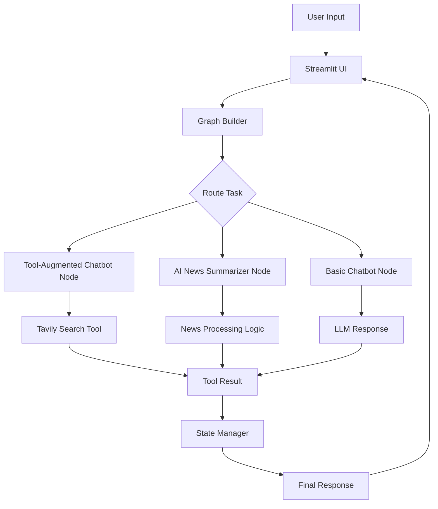

### Integration Flow

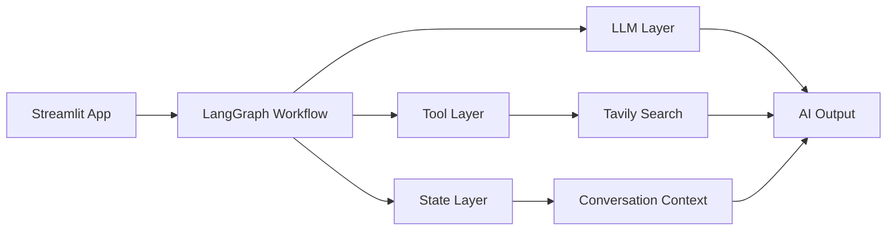

### Why It Matters

This project shows understanding of agent architecture, not just prompt engineering. It demonstrates how to separate workflow responsibilities into modular nodes.

### Challenges Solved

- Modular AI workflow design
- Multi-step orchestration
- Tool calling integration
- State management
- Clean separation between UI, graph, tools, and model calls


I used LangGraph to break the AI workflow into nodes. This makes the system easier to debug and extend because each node has one responsibility, and the graph controls how the task moves from one step to another.

---

## 3. PDF RAG Assistant

**Category:** Document AI / RAG  
**Repository:** [PDF-RAG-Assistant](https://github.com/seshukalyanam/PDF-RAG-Assistant)

### What It Does

This project lets users ask natural language questions over PDF documents using a RAG pipeline. It extracts content, chunks it, embeds it, stores it in FAISS, retrieves relevant context, and generates grounded answers.

### Problem Statement

PDFs are often long and hard to search manually. Keyword search misses semantic meaning. This assistant uses embeddings and retrieval to find relevant context before answering.

### Tech Stack

- Python
- OpenAI embeddings
- FAISS
- PDF parsing
- Prompt templates
- Optional reranking
- CLI / interactive assistant flow

### RAG Pipeline

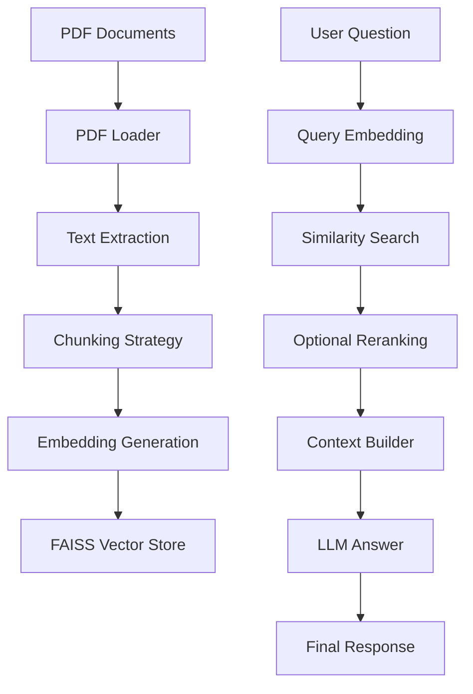

### Integration Flow

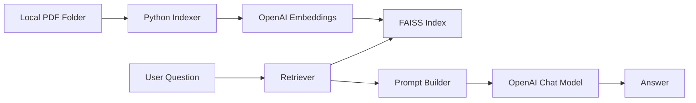

### Why It Matters

This project shows the foundation of RAG: ingestion, chunking, embeddings, retrieval, prompt construction, and response generation.

### Challenges Solved

- Turning raw PDF text into usable chunks
- Creating reusable vector indexes
- Keeping indexing separate from querying
- Improving answer quality through retrieval and optional reranking


I separated indexing from querying so users do not need to process PDFs every time. Once the FAISS index is built, the user can ask questions directly until the document set changes.

---

## 4. AI-Powered Trading Card Grading Engine

**Category:** Computer Vision / ML App  
**Repository:** [AI-Powered-Card-Grading-Engine](https://github.com/seshukalyanam/AI-Powered-Card-Grading-Engine)

### What It Does

This project predicts the condition grade of trading cards from images. It combines deep learning with custom image features such as corners, centering, and edge density.

### Problem Statement

Manual trading card grading is subjective and time-consuming. The goal was to build an AI-assisted model that can identify visual quality signals from card images.

### Tech Stack

- Python
- TensorFlow / Keras
- OpenCV
- PIL
- Streamlit
- Azure Blob Storage
- Hugging Face Hub
- CSV metadata

### Model Pipeline

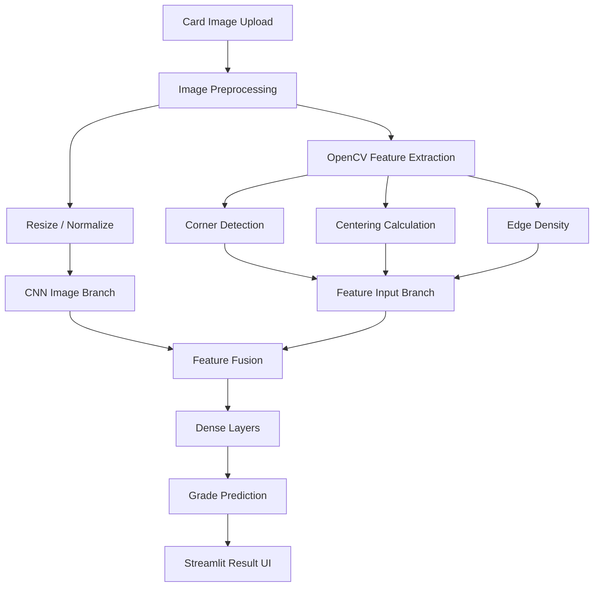

### Integration Flow

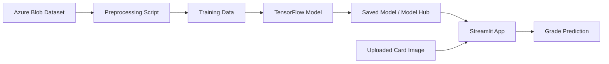

### Why It Matters

This project demonstrates practical ML engineering beyond text-based AI. It includes image preprocessing, feature engineering, model training, storage integration, and a user-facing app.

### Challenges Solved

- Preprocessing inconsistent card images
- Extracting grading-related visual features
- Combining custom features with CNN-based image learning
- Creating a lightweight app for inference


I treated card grading as both a computer vision and feature engineering problem. Instead of only using a CNN, I added handcrafted features like corners, centering, and edges so the model could learn grading-specific signals.

---

## 5. Voice-Interactive Multi-Agent AI Platform

**Category:** Voice AI / Multi-Agent System  
**Type:** Professional AI system / advanced prototype

### What It Does

This system allows users to speak naturally, converts speech to text in real time, routes the request to the right expert agent, and streams back contextual responses. It was designed around low latency and multi-agent orchestration.

### Problem Statement

Traditional chatbots are text-first and usually single-purpose. A voice-first AI assistant needs live transcription, real-time communication, agent routing, summarization, and session memory.

### Tech Stack

- Google ADK
- Gemini Live transcription
- WebSockets
- Python backend services
- Multi-agent orchestration
- Context management
- Streaming response logic

### Voice AI Pipeline

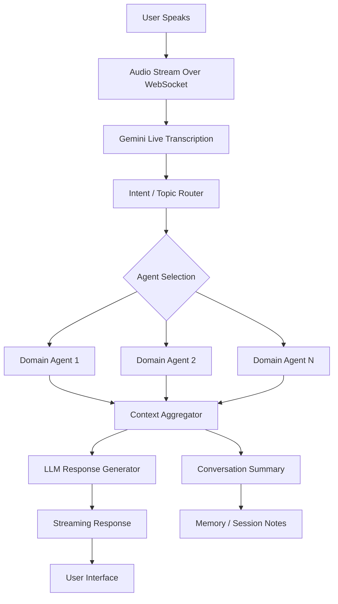

### Integration Flow

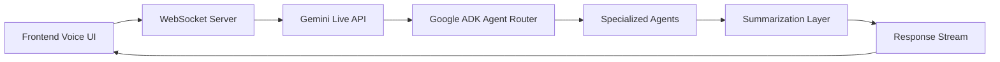

### Why It Matters

This project shows real-time AI system design beyond a normal chatbot. It combines speech AI, agent orchestration, streaming infrastructure, and memory.

### Challenges Solved

- Low-latency audio streaming
- Real-time transcription
- Routing requests to specialized agents
- Reducing context size through summarization
- Maintaining useful session memory


The key challenge was latency. I used streaming transcription, WebSocket communication, and agent routing so the system could respond naturally instead of waiting for a long batch process.

---

## 6. Courtroom Transcription Intelligence Platform

**Category:** Speech AI / AWS Integration  
**Type:** Professional client-style integration

### What It Does

This system integrates AI-powered transcription into a legal/courtroom workflow. It uses AWS Transcribe, custom vocabulary, custom language models, and speaker diarization to improve transcription accuracy.

### Problem Statement

Courtroom audio is difficult because it includes multiple speakers, legal terminology, background noise, overlapping speech, and domain-specific names. The system needed to produce cleaner transcripts with speaker separation.

### Tech Stack

- AWS Transcribe
- AWS S3
- Custom Vocabulary
- Custom Language Models
- Speaker Diarization
- Backend APIs
- Python processing services

### Transcription Pipeline

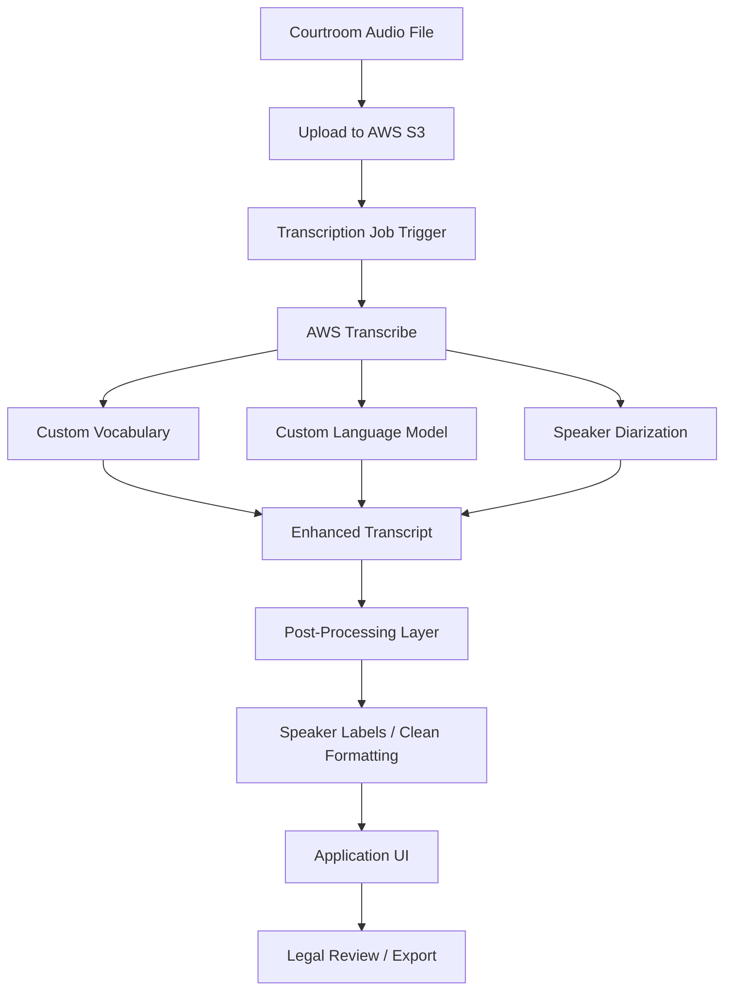

### Integration Flow

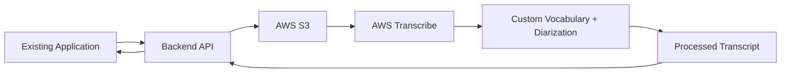

### Why It Matters

This project shows how AI can be added into an existing workflow rather than being built as a standalone demo. It also demonstrates domain-specific AI improvement using cloud speech services.

### Challenges Solved

- Handling multiple speakers
- Improving legal terminology recognition
- Integrating cloud transcription with an existing app
- Producing cleaner output for review and export


This was not just a speech-to-text integration. I focused on improving courtroom-specific transcription accuracy using AWS Transcribe features like custom vocabulary, custom language models, and diarization, then connected the output back into the existing application.

---

## 7. AI-Powered Customer Support Bot with Azure OpenAI and Azure AI Search

**Category:** Enterprise Copilot / Support Automation

### What It Does

This support bot answers customer or internal user questions using indexed knowledge sources. It uses Azure OpenAI for answer generation and Azure AI Search for retrieval.

### Problem Statement

Support teams often answer repeated questions from documents, FAQs, manuals, and internal knowledge bases. The goal was to reduce manual search and provide quick, grounded answers.

### Tech Stack

- Azure OpenAI
- Azure AI Search
- Python backend
- REST APIs
- Streamlit or web UI
- Document ingestion
- Embeddings

### Support Bot Pipeline

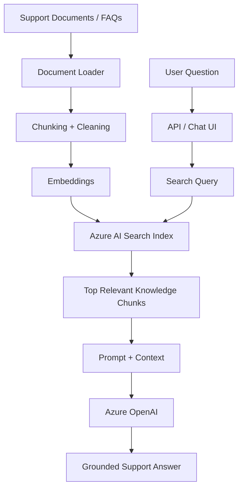

### Integration Flow

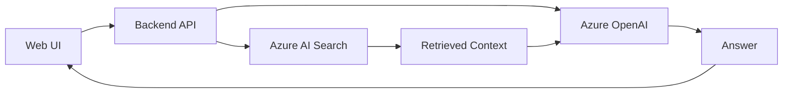

### Why It Matters

This project shows practical RAG integration for customer support and enterprise knowledge access.

### Challenges Solved

- Reducing hallucination through retrieval
- Creating reusable document indexes
- Connecting AI responses to a web/API workflow
- Returning answers grounded in company knowledge


I built this as a practical RAG support assistant. The system retrieves the right knowledge first, then lets the LLM generate a response using only that context.

---

## 8. MS Teams RBAC Enterprise Chatbot

**Category:** Enterprise Chatbot / Access Control

### What It Does

This system uses Microsoft Teams and Microsoft Graph-style integrations to create a role-aware chatbot. The chatbot can respond differently depending on user role, permissions, and department context.

### Problem Statement

Enterprise AI assistants cannot expose the same information to every user. A manager, admin, engineer, and executive may have different access levels.

### Tech Stack

- Microsoft Teams
- Microsoft Graph API
- Azure OpenAI / GPT-4
- RBAC logic
- Enterprise knowledge base
- Backend APIs

### RBAC Chatbot Flow

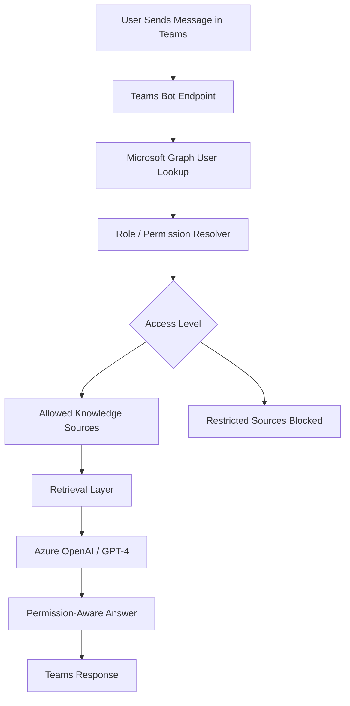

### Integration Flow

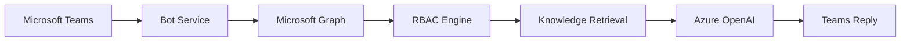

### Why It Matters

This project demonstrates enterprise security thinking in AI applications. The LLM should not be the only security layer; the backend must control access before context is sent to the model.

### Challenges Solved

- Role-based answer control
- Preventing unauthorized context exposure
- Integrating Teams and enterprise identity
- Separating deterministic access control from model generation


I designed this so the LLM is not responsible for security by itself. The backend first checks the user's role, then only sends allowed context to the model.

---

## 9. Auto Insurance Quote Agent using n8n, AI, and PostgreSQL

**Category:** Workflow Automation / Conversational Business App

### What It Does

This project is a conversational insurance quote assistant that collects user information, calculates quote options, stores quote data, and supports follow-up workflows.

### Problem Statement

Insurance quote collection usually requires long forms. The goal was to create a guided AI workflow that collects required details naturally and generates structured quote tiers.

### Tech Stack

- n8n
- OpenAI / Gemini
- PostgreSQL
- Webhooks
- Code nodes
- Email notification workflow
- Quote generation logic
- Session tracking

### Quote Workflow

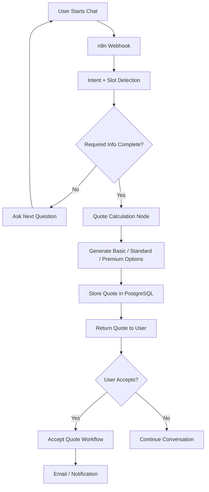

### Integration Flow

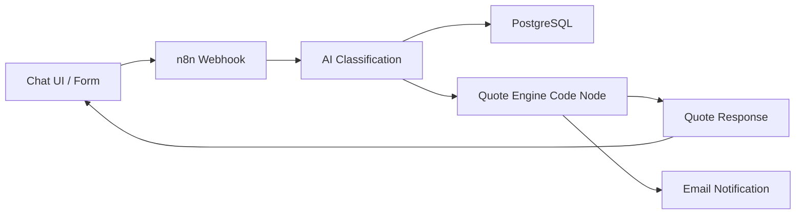

### Why It Matters

This project demonstrates AI workflow automation using low-code orchestration, database state, and deterministic business logic.

### Challenges Solved

- Collecting structured information conversationally
- Storing user/session data in PostgreSQL
- Separating AI extraction from quote calculation
- Triggering follow-up workflows after quote acceptance


I used n8n as the orchestration layer and PostgreSQL as the source of truth. The AI handled conversation and extraction, while deterministic code handled quote calculation.

---

## 10. Electrical Project Intelligence Copilot

**Category:** Domain-Specific RAG / Construction AI

### What It Does

This project is a domain-specific assistant for electrical project documentation across building types such as schools, hospitals, and food marts. It can answer questions over drawings, PDFs, equipment schedules, component data, and project notes.

### Problem Statement

Construction and electrical teams deal with many documents across different buildings and scopes. A useful AI assistant must understand which project, building, component, and document type the question refers to.

### Tech Stack

- Streamlit
- Python
- Local folder-based document store
- Optional Ollama / local LLM
- Gemini or OpenAI option
- Embeddings
- RAG pipeline
- Project-specific datasets

### Project-Aware RAG Flow

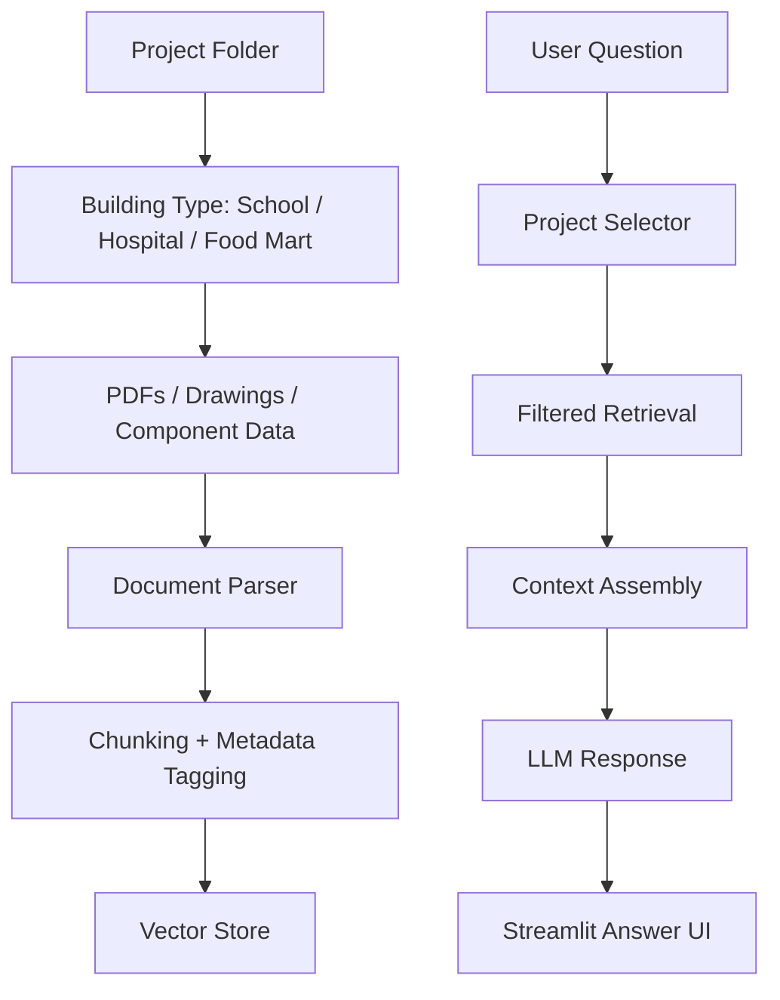

### Integration Flow

```mermaid
flowchart LR
    A[Streamlit UI] --> B[Python Backend]
    B --> C[Local Project Folders]
    B --> D[Embedding Model]
    D --> E[Vector Store]
    B --> F[Ollama / Gemini / OpenAI]
    E --> F
    F --> G[Project-Specific Answer]
    G --> A
```

### Why It Matters

This project shows how RAG can be specialized for construction and engineering workflows, where answers must depend on project context and metadata.

### Challenges Solved

- Separating multiple buildings and document types
- Adding metadata for better retrieval
- Supporting local and cloud LLM options
- Creating a Streamlit UI for project teams


I designed this as a project-aware RAG assistant. The important part is metadata because the system should know which building, document type, and component category the answer is coming from.

---

## 11. Bird Sound Identification using Spatial Audio and Diarization

**Category:** Audio AI / Deep Learning

### What It Does

This project identifies bird species from audio recordings by combining signal processing, audio features, and deep learning.

### Problem Statement

Bird audio classification is challenging because field recordings contain background noise, overlapping calls, similar species vocalizations, and inconsistent recording quality.

### Tech Stack

- Python
- TensorFlow
- Librosa
- PyDub
- MFCC features
- Mel-spectrograms
- CNN / RNN model design
- Audio diarization concepts

### Audio AI Pipeline

```mermaid
flowchart TD
    A[Field Audio Recording] --> B[Audio Preprocessing]
    B --> C[Noise Reduction / Segmentation]
    C --> D[Feature Extraction]
    D --> E[MFCC Features]
    D --> F[Mel-Spectrograms]
    D --> G[Spatial / Stereo Features]
    E --> H[CNN / RNN Model]
    F --> H
    G --> H
    H --> I[Species Prediction]
    I --> J[Confidence Score]
    J --> K[Result Display]
```

### Integration Flow

```mermaid
flowchart LR
    A[Audio Dataset] --> B[Preprocessing Pipeline]
    B --> C[Librosa Feature Extraction]
    C --> D[TensorFlow Model]
    D --> E[Real-Time / Batch Inference]
    E --> F[Predicted Bird Species]
```

### Why It Matters

This project shows ML experience outside text-based GenAI. It demonstrates signal processing, feature extraction, model training, and noisy real-world data handling.

### Challenges Solved

- Handling background noise
- Extracting useful frequency-domain features
- Considering overlapping audio sources
- Combining temporal and spectral information


This project helped me work with non-text AI. I treated bird sound as a signal processing problem first, then used deep learning to classify species from extracted audio features.

NOTE: This is a personal project still under progress. 

---

## 12. Brand-Influencer Matching and Sentiment Engine

**Category:** Recommendation AI / NLP

### What It Does

This project matches brands with relevant influencers by analyzing influencer content, audience signals, sentiment, product fit, and brand alignment.

### Problem Statement

Brands often choose influencers based on follower count, but follower count alone does not show audience fit, content quality, or sentiment alignment.

### Tech Stack

- GPT-4 / LLM analysis
- NLP sentiment detection
- Azure AI Search
- Social media data sources
- Embeddings
- Recommendation logic
- Dashboard or API output

### Recommendation Pipeline

```mermaid
flowchart TD
    A[Influencer Profiles / Posts] --> B[Data Collection]
    B --> C[Text Cleaning + Metadata Extraction]
    C --> D[Embedding + Sentiment Analysis]
    D --> E[Influencer Profile Index]
    F[Brand / Product Input] --> G[Brand Requirement Parser]
    G --> H[Semantic Matching]
    H --> E
    E --> I[Ranked Influencer Matches]
    I --> J[LLM Explanation]
    J --> K[Recommendation Output]
```

### Integration Flow

```mermaid
flowchart LR
    A[Social Data Sources] --> B[Ingestion Pipeline]
    B --> C[Azure AI Search]
    B --> D[NLP Sentiment Model]
    C --> E[Matching Engine]
    D --> E
    F[Brand Query] --> E
    E --> G[GPT-4 Explanation]
    G --> H[Ranked Recommendations]
```

### Why It Matters

This project connects AI with business decision-making. It uses search, NLP, and LLM explanations to make recommendations more transparent.

### Challenges Solved

- Matching brands and influencers semantically
- Adding sentiment as a ranking signal
- Explaining recommendations in business language
- Designing the flow so more data sources can be added later


I built this as a recommendation system where LLMs explain the match, but the ranking is supported by embeddings, sentiment, and structured criteria.

---

# Integration Playbook

## 1. RAG Integration Pattern

```mermaid
flowchart LR
    A[Documents / PDFs / Data Sources] --> B[Parser]
    B --> C[Chunker]
    C --> D[Embedding Model]
    D --> E[Vector Store]
    F[User Query] --> G[Retriever]
    G --> E
    E --> H[Relevant Context]
    H --> I[Prompt Builder]
    I --> J[LLM]
    J --> K[Grounded Answer]
```

Used in:

- Multi-Tenant RAG System
- PDF RAG Assistant
- Azure Customer Support Bot
- Electrical Project Intelligence Copilot

---

## 2. Multi-Agent Integration Pattern

```mermaid
flowchart LR
    A[User Request] --> B[Router / Planner]
    B --> C{Task Type}
    C --> D[Research Agent]
    C --> E[Retrieval Agent]
    C --> F[Tool Agent]
    C --> G[Summary Agent]
    D --> H[Shared State]
    E --> H
    F --> H
    G --> H
    H --> I[Final Response]
```

Used in:

- Voice-Interactive Multi-Agent AI Platform
- Agentic AI Workflow System
- Enterprise AI automation workflows

---

## 3. Cloud AI Integration Pattern

```mermaid
flowchart TD
    A[Application Backend] --> B{Cloud Service Needed}
    B --> C[AWS: Transcribe / Bedrock / S3 / Lambda]
    B --> D[Azure: OpenAI / AI Search / ML / Functions]
    B --> E[GCP: Gemini / ADK / Vertex AI]
    C --> F[AI Output / Processed Data]
    D --> F
    E --> F
    F --> G[Application Response / Dashboard / Workflow]
```

Used in:

- Courtroom Transcription Platform
- Multi-Tenant RAG
- Voice AI Platform
- Azure Support Bot
- ML deployment workflows

---

## 4. Workflow Automation Pattern

```mermaid
flowchart LR
    A[Trigger: Chat / Form / Webhook] --> B[n8n / API Orchestrator]
    B --> C[AI Extraction / Classification]
    C --> D[Database Update]
    C --> E[Business Logic]
    E --> F[Notification / Email]
    E --> G[User Response]
```

Used in:

- Auto Insurance Quote Agent
- Lead Email Responder
- Customer support workflows
- Recruiter-style automation experiments

---

## 5. Web App AI Integration Pattern

```mermaid
flowchart LR
    A[User Interface] --> B[Backend API]
    B --> C[AI Service Layer]
    C --> D[LLM / ML Model]
    C --> E[Retrieval / Database]
    D --> F[Response Formatter]
    E --> F
    F --> A
```

Used in:

- Streamlit AI apps
- React-integrated AI features
- RAG chat systems
- Computer vision model demos

---

# Project Summary Matrix

| Project | Main Category | Key Integrations | Main Value |
|---|---|---|---|
| Multi-Tenant RAG System | Enterprise RAG | Azure OpenAI, Azure AI Search, Streamlit | Secure document Q&A with tenant isolation |
| Agentic AI with LangGraph | Agent Orchestration | LangGraph, LangChain, OpenAI, Groq, Tavily | Modular AI workflows with tool usage |
| PDF RAG Assistant | Document AI | OpenAI, FAISS, embeddings, PDF parsing | PDF question-answering using semantic search |
| Card Grading Engine | Computer Vision | TensorFlow, OpenCV, Streamlit, Azure Blob | AI-assisted card condition grading |
| Voice Multi-Agent Platform | Voice AI / Agents | Gemini Live, Google ADK, WebSockets | Real-time voice interaction with expert agents |
| Courtroom Transcription Platform | Speech AI | AWS Transcribe, S3, diarization, custom vocabulary | More accurate legal transcription workflow |
| Azure Support Bot | Enterprise Copilot | Azure OpenAI, Azure AI Search, REST APIs | Grounded support automation |
| MS Teams RBAC Chatbot | Enterprise AI Security | Teams, Microsoft Graph, GPT-4, RBAC | Permission-aware enterprise chatbot |
| Auto Insurance Agent | Workflow Automation | n8n, PostgreSQL, Gemini/OpenAI, webhooks | Conversational quote automation |
| Electrical Project Copilot | Domain RAG | Streamlit, local folders, embeddings, LLMs | Project-aware construction/electrical assistant |
| Bird Sound Identification | Audio AI | TensorFlow, Librosa, PyDub, MFCC | Bird species detection from field audio |
| Influencer Matching Engine | Recommendation AI | GPT-4, Azure AI Search, NLP sentiment | Brand-influencer matching with explanations |

---

## How I Explain My Integration Experience

I do not treat AI as a standalone chatbot. Most of my work is about connecting AI into real systems.

A typical integration I build includes:

1. A user-facing interface such as Streamlit, Teams, React, or a web app.
2. A backend API or workflow layer that controls execution.
3. An AI orchestration layer using LangChain, LangGraph, Google ADK, or custom Python logic.
4. A retrieval or data layer using Azure AI Search, FAISS, PostgreSQL, S3, Azure Blob, or vector databases.
5. External APIs such as AWS Transcribe, Gemini Live, Microsoft Graph, email APIs, or cloud AI services.
6. A response layer that returns answers, summaries, transcripts, recommendations, reports, or workflow actions.

The main engineering focus is making the AI useful, grounded, secure, and connected to the business process.

---

# Technical Strengths Demonstrated

## AI System Design

- Designed RAG and non-RAG architectures depending on the use case.
- Built systems with retrieval, memory, routing, tool calling, and summarization.
- Considered latency, token usage, cost, and context management.

## Cloud AI Engineering

- Integrated Azure OpenAI, Azure AI Search, Azure ML, AWS Transcribe, AWS Bedrock, S3, Lambda, and Gemini-based services.
- Built AI systems that connect cloud APIs with real user workflows.
- Used cloud storage and serverless patterns for scalable processing.

## Backend and API Integration

- Connected AI models to REST APIs, WebSockets, workflow tools, and database systems.
- Designed backend flows that separate business logic from LLM reasoning.
- Used deterministic code for validation, access control, quote calculation, and routing.

## Data and Retrieval Engineering

- Built document ingestion pipelines.
- Used chunking, embeddings, vector search, metadata filtering, and reranking.
- Designed tenant-aware retrieval systems to prevent data leakage.

## Practical AI Product Thinking

- Focused on real workflows, not only model demos.
- Built user-facing interfaces using Streamlit and web app patterns.
- Added memory, session handling, and structured outputs where needed.

---

# Future Improvements

## Deployment

- Add Docker support for each major app.
- Add cloud deployment options using Azure App Service, AWS ECS, or Streamlit Community Cloud.
- Add environment variable templates and secure secret handling.

## Evaluation

- Add RAG evaluation scripts.
- Track retrieval precision, hallucination rate, latency, and response quality.
- Add test questions and expected answers for each document AI project.

## Observability

- Add logging for user queries, retrieved chunks, token usage, and model latency.
- Add simple dashboards for debugging AI responses.

## Security

- Add role-based access control where needed.
- Add tenant-specific authorization checks.
- Avoid exposing API keys, private documents, or model credentials.

## User Experience

- Add better chat history management.
- Add file upload and progress indicators.
- Add source citations for RAG answers.
- Add export options for transcripts, summaries, and reports.

---

# Final Statement

My AI engineering work is centered on building usable, integrated, and production-minded AI systems.

I focus on connecting models with real data, real APIs, real workflows, and real user interfaces. Whether it is a secure multi-tenant RAG system, a voice-based multi-agent assistant, an AWS transcription workflow, or a computer vision grading engine, the goal is the same: build AI systems that are practical, explainable, scalable, and useful in real business environments.
