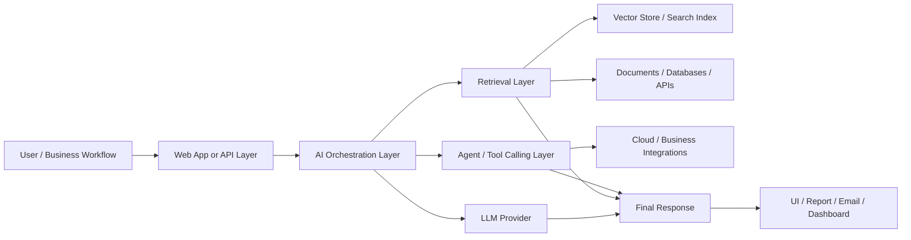

# Hi, I'm Sesha Sai Kalyanam

## AI Engineer | RAG Systems | Multi-Agent Workflows | Cloud AI Integrations

I build practical AI systems that connect **LLMs, vector search, cloud services, APIs, databases, automation tools, and user-facing applications** into usable workflows.

My work focuses on building AI systems that are not just demos, but production-minded applications with clear data flow, retrieval logic, orchestration, and integration layers.

---

## What I Build

- Retrieval-Augmented Generation systems
- Multi-agent AI workflows
- AI-backed web applications
- Voice AI and transcription intelligence
- Cloud-native ML and GenAI platforms
- Secure multi-tenant knowledge systems
- Workflow automation using APIs and databases
- Computer vision and audio ML applications

---

## Core AI Engineering Stack

| Area | Tools / Platforms |
|---|---|
| LLMs & GenAI | Azure OpenAI, OpenAI, Gemini, AWS Bedrock, Groq, Hugging Face |
| Agent Frameworks | LangChain, LangGraph, AutoGen, CrewAI, Google ADK |
| Retrieval & Vector Search | Azure AI Search, FAISS, Pinecone, pgvector, embeddings |
| Cloud Platforms | Azure, AWS, GCP |
| Data & Storage | PostgreSQL, S3, Azure Blob Storage, local document stores |
| Web Apps | Streamlit, React collaboration, REST APIs, WebSockets |
| Automation | n8n, webhooks, API orchestration, background workflows |
| Enterprise Integrations | Microsoft Teams, Microsoft Graph, AWS Transcribe, Gmail/SMTP |

---

## AI System Design Approach

---

## Featured Projects

| Project | Category | Key Integrations | Value |
|---|---|---|---|
| [MultiTenant Isolated RAG System](https://github.com/seshukalyanam/MultiTenant-Isolated-RAG-System) | Enterprise RAG | Azure OpenAI, Azure AI Search, tenant-level retrieval | Secure document Q&A with tenant isolation |
| [Agentic AI](https://github.com/seshukalyanam/Agentic-AI) | Multi-Agent AI | LangGraph, LangChain, Streamlit, tool calling | Modular AI workflows with routing and tools |
| [PDF RAG Assistant](https://github.com/seshukalyanam/PDF-RAG-Assistant) | Document AI | OpenAI, FAISS, embeddings, PDF parsing | Ask questions over PDFs using semantic retrieval |
| [AI-Powered Card Grading Engine](https://github.com/seshukalyanam/AI-Powered-Card-Grading-Engine) | Computer Vision | TensorFlow, OpenCV, Streamlit, Azure Blob | AI-assisted trading card condition grading |
| Voice-Interactive Multi-Agent Platform | Voice AI | Gemini Live, Google ADK, WebSockets | Real-time voice assistant with expert agents |
| Courtroom Transcription Intelligence | Speech AI | AWS Transcribe, S3, custom vocabulary, diarization | Improved legal transcription workflow |
| Auto Insurance Quote Agent | Workflow Automation | n8n, PostgreSQL, OpenAI/Gemini, webhooks | Conversational quote collection and automation |
| Electrical Project Intelligence Copilot | Domain RAG | Streamlit, local project folders, embeddings, LLMs | Project-aware assistant for electrical/construction docs |

---

## Project Showcase

I created a detailed portfolio-style project and integration write-up here:

**[Read the full Project & Integration Showcase](./PROJECT_SHOWCASE.md)**

It includes:

- Architecture diagrams
- End-to-end system flows
- Integration maps
- Problem statements
- Tech stacks
- Challenges solved
- Interview talking points
- Future improvement plans

---

## How I Think About AI Integration

I do not treat AI as a standalone chatbot. Most of my work is about connecting AI into real systems.

A typical system I build includes:

1. A user interface such as Streamlit, Teams, React, or a web app.
2. A backend API or workflow layer that controls the execution.
3. An AI orchestration layer using LangChain, LangGraph, Google ADK, or custom Python logic.
4. A retrieval or data layer using Azure AI Search, FAISS, PostgreSQL, S3, Azure Blob, or vector databases.
5. External integrations such as AWS Transcribe, Gemini Live, Microsoft Graph, email APIs, or cloud AI services.
6. A response layer that returns answers, summaries, transcripts, recommendations, reports, or workflow actions.

---

## Areas I Am Actively Building In

- Agentic RAG systems
- Enterprise copilots
- Voice AI assistants
- Secure multi-tenant AI apps
- AI workflow automation
- Cloud-native GenAI deployments
- Evaluation and observability for AI systems
- Practical AI applications for business workflows

---

## Contact

- GitHub: [github.com/seshukalyanam](https://github.com/seshukalyanam)
- Email: kalyanamseshasai@gmail.com

---

## Positioning Statement

I build integrated AI systems that connect models with real data, real APIs, real workflows, and real user interfaces. My goal is to create AI applications that are useful, scalable, explainable, and practical for real business environments.
